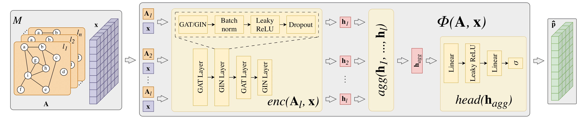

# Inf. Max. with ML methods for Multilayer Networks

A repository to train and evaluate Influence Maximisation ML models for multilayer networks. This code was used in the preparation of the paper [Identifying Super Spreaders in Multilayer Networks](https://arxiv.org/abs/2505.20980).

### Architecture diagram of TopSpreadersNetwork


This repository is part of a broader research codebase composed of multiple interrelated components, each addressing a specific aspect of the Influence Maximisation pipeline:

I. [infmax-trainer-icm-mln](https://github.com/network-science-lab/infmax-trainer-icm-mln) - training `ts-net`. <br>
II. [infmax-simulator-icm-mln](https://github.com/network-science-lab/infmax-simulator-icm-mln) -  computing spreading potential and evaluating influence maximisation methods.. <br>
III. [top-spreaders-dataset](https://github.com/network-science-lab/top-spreaders-dataset) - storage and access layer for the `TopSpreadersDataset`. <br>

* Authors: Piotr Bródka, Michał Czuba, Adam Piróg, Mateusz Stolarski, Piotr Bielak
* Affiliation: WUST, Wrocław, Lower Silesia, Poland

## Runtime configuration

I. First, initialise the environment:

```bash
conda env create -f env/conda.yaml
conda activate infmax-trainer-icm-mln
pip install pyg-lib -f https://data.pyg.org/whl/torch-2.3.1+cu121.html
```

II. Then, pull the Git submodule with data loaders and install its code:

```bash
git submodule init && git submodule update
pip install -e data
```

## Structure of the repository
```
├── data                    -> evaluated networks
├── env                     -> a definition of the runtime environment
├── model                   -> exported model weights & configuration
├── scripts                 -> pipeline entries
│   ├── configs             -> def. of the training configs
│   ├── analysis            -> def. of the model architecture
├── src                     -> a module with main implementation
│   |── data_models         -> an extension of HeteroData from torch_geometric
│   |── datamodule         -> def. of the data loaders
│   |── dataset             -> implemented datasets for preparing HeteroData
│   |── infmax_models       -> trainable ML models for Influence Maximisation
│   |── training            -> code related to training execution
│   │   ├── loss            -> loss functions used in the training
│   │   ├── callbacks.py    -> allowed training callbacks defined in executed config
│   │   ├── loggers.py      -> allowed training loggers defined in executed config
│   │   └── trainer.py      -> script to train models according to provided configs
│   |── utils               -> the logic for helpers across the whole repository
│   └── wrapper             -> the wrappers for trainable models implemented in torch
├── README.md
├── run_evalation.py        -> main entrypoint to trigger the evaluation pipeline
└── run_experiments.py      -> main entrypoint to trigger the training pipeline
```

## Source Data Files

The _TopSpreadersDataset_ is managed using DVC. To fetch it, follow the instructions in
[README.md](data/top_spreaders_dataset/README.md). Additionally, most of results obtained with this 
repository is also stored with DVC - below we describe how to fetch them.

### Full Access

To download the result files, you must authenticate with a Google account that has access to the
shared Google Drive storage:
https://drive.google.com/drive/u/1/folders/1pLWobDjds8SF5rh9_HlvSd9B3ja8QdqN. If you
need access, please contact one of the contributors. Then, to fetch the data, run `dvc pull`.

### Paper Version

A public DVC configuration for the result files in a version used in the paper is available at: https://drive.google.com/file/d/14p4EDGq4acUOVnqenDyBSbtI9bPF7Jta. To use it, unpack the archive, and move its contents into the `.dvc` directory of this project. Then, execute: `dvc checkout`.

## Using the package

To run experiments, execute `run_experiments.py` or `run_evaluation.py` and provide the appropriate configuration in `scripts/configs` directory. See examples in `scripts/configs` for reference.

### Running the training pipeline (`run_experiments.py`)

To run experiments execute: `run_experiments.py` and provide proper CLI arguments defined in `scripts/configs/hydra.yaml`, i.e. a name of the configuration file.

To select device on remote server please set up envitonment variable: `export CUDA_VISIBLE_DEVICES=2` and then in the config file select list of devices as `[0]`.

To train model without `neptune.ai` set up `tensor_board` logger in configuration file.

### Running the evaluation pipeline (`run_evaluation.py`)
To run evaluation execute: `run_evaluation.py` and provide proper CLI arguments defined in `scripts/configs/evaluation.yaml`, i.e. a name of the experiment or test networks.

To run it without access to `neptune.ai`, set the value of `base/neptune` to `False`. This will enforce the local configuration from the `model` directory.

### `neptune.ai` dashboard

The dashboard is here: https://app.neptune.ai/o/infmax/org/infmax-gnn/runs/table?viewId=standard-view.
Prior using it please fill in the `AUTH_KEY` in the `.env` file (as shown in `.env-example`).
